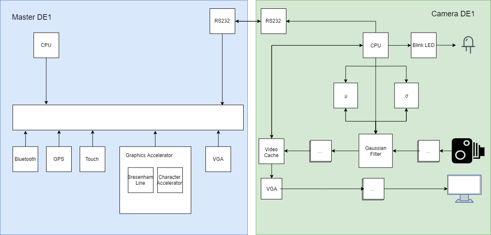

# UBCam

## Overview

UBCam is an automated security system that implements a **computer vision** algorithm for outlier detection on **FPGA**s to detect intruders from a  **real-time video** feed and alert users through an **Android** app. Using a master-slave architecture, we integrated two FPGAs via serial communication to implement our hardware system. The slave FPGA uses video processing cores, both provided by Intel's University program and built by ourselves, to learn and filter out the background from a live video feed. Using a master DE1 that integrates a touchscreen LCD and networking modules, we allow the users to control the slave DE1, training the device, its sensitivity while filtering, and enabling its intruder alerts. To extend the control functionality, we connected our hardware system to a cloud service and built an Android app to remotely monitor the system, visualize historic data using Google Maps, and obtain recommendations for new system placements from our **cloud service** which uses **machine learning** to predict areas most prone to crime.

<!-- TODO: embed youtube video -->
## Background
<div class="row">
  <div class="column">
    
  </div>
  <div class="column">
    
  </div>
</div>
Gaussian background subtraction is a computer vision algorithm for highlighting foreground objects/outliers. For a given image of *n x m* pixels, we assume that every pixel comes from a Gaussian distribution. During training, we sample snapshots of the background to compute the average grayscale value and the variance caused by natural noise to "learn" the background. Once trained, we are able to highlight foreground objects by taking the difference between the input image and our reference background image and filtering out pixels that are explained by the variance learned during training.

## Hardware System

The above depicts a block diagram of our hardware system. Due to SRAM size limitations on the DE1-SoC, the hardware system uses two FPGAs, one master and one slave, to filter the video stream and interact with the external world.

### Slave FPGA
The slave FPGA uses a series of video processing cores provided by Intel University Program to compress a 640x480 YCrCb video stream to a 320x240 grayscale video stream. The custom Gaussian filter acclerator removes the background from the processed video stream using the following algorithm:

```
- let the soft-core CPU learn the background by computing the average and the variance from n frame samples, and storing them in a SRAM cache
- obtain the user-defined threshold for what is considered the an outlier

- for every pixel in a 320x240 8-bit grayscale video packet,
	- retrieve its respective mean and standard deviation from the SRAM cache through memory-mapped master interface
	- if the variance of the input pixel relative to the learned background is greater than the user-defined threshold,
		- allow the pixel value to go through
	- otherwise,
		- floor the pixel color to black

- pass the filtered stream to the next series of processing cores that uncompresses the video to fit a 640x480 VGA output and ultimately displays the video.
```
By offloading the work to an accelerator, we achieve real-time video processing. The below shows the digital logic of the Gaussian filter accelerator.
<div class="column">
	 
</div>
### Master FPGA
The master FPGA integrates a touchscreen LCD, networking modules, and custom accelerators (i.e.: Bresenham line-drawing accelerator, and a character-writing accelerator) to interface the slave FPGA with the user, the remote server, and the Android app. Using custom drivers, we retrieve user inputs from the touchscreen LCD and the Android device via bluetooth, issue commands to the slave DE1 via RS232 to learn the background and enable the filter, and transfer images to the remote server via WIFI.

## Android App
The Android app uses RxAndroid, Room Persistence Library, Retrofit, and Google Maps API to remotely control the hardware system, visualize historic data retrieved from our cloud system, and obtain recommendations for new camera systems to maximize crime coverage.

- **visualization**: queries a local, cached database that synchronizes periodically with the remote server to get the coordinates and frequency of intruders detected for a given timeframe. Then, we plot the crime density using a minimalistic Google Maps.

- **recommendation**: we implemented maximum likelihood estimates (MLE) of a Gaussian mixture model to recommend the most problematic areas to be reinforced with additional monitoring systems. As a proof-of-concept, we used the crime dataset from 2003 to 2019 provided publically by the Vancouver Police Department to build our recommender model.
 


## Source Code
Due to plagiarism policies set by UBC, we are unable to share our source code at this time.

## Author's Notes
